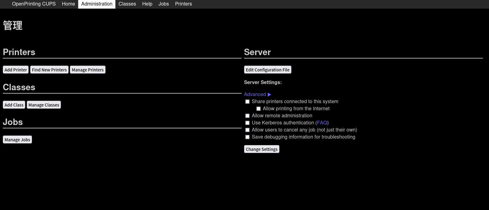

# 介绍
## CUPS 是什么？
>CUPS 是许多不同 Linux 发行版上使用的打印系统。它的使用非常广泛，因为它已成为大多数流行 Linux 发行版上的标准打印管理器。它充当打印后台处理程序、调度程序、打印作业管理器，并且可以存储大量本地或网络打印机的信息。
## 为什么我要搭建它？

我个人原因是因为手头有闲置的arm板子，并且家里的打印机也比较老，不能联网。通过搭建CUPS,我就可以在免开电脑的情况下用手机完成打印任务啦，并且家人也可随时使用。CUPS的跨平台也提供了很大的便利性。


# 搭建
## 材料
- 一台linux设备
	- 有USB口
	- 低功耗(可选)
- 一条打印机线(一般是type A)
- 一台打印机(~~这不是废话吗QAQ~~)
- 一颗爱折腾的心～
### 安装调整CUPS
> 本部分使用Debian/Ubuntu进行示范

CUPS在各大发行版的包管理器皆可下载安装
```bash
sudo apt install cups ghostscript avahi-daemon
```
安装之后就可以启动了再开放远程管理权限和共享
```bash
sudo systemctl enable cups # 开机自启动
sudo systemctl start cups
sudo cupsctl --remote-admin
sudo cupsctl --share-printers
sudo cupsctl -U admin #将admin替换成c你当前用户名
```

### 安装打印机驱动
~~众所周知，在linux环境下驱动都很麻烦~~
首先安装`foomatic`这个包，内置了大部分驱动
```bash
sudo apt install foomatic
```

如果依旧没有可以到[OpenPrinting](https://www.openprinting.org/printers)查找自己的打印机型号，一般都有对应的驱动

> HP的打印机可以安装`hplib`进行驱动管理（不太推荐,没驱动再用）
### 配置CUPS
cups启动后会在631端口打开


在Add Printer选项中选择你用USB连接好的打印机 ,并选好对应的型号，就可以进行共享
## 如何使用
### Windows
Win+i 进入设置- 设备-打印机-刷新-添加打印机-我的设备不在列表-按名称选择共享打印机-粘贴URL
`http://<server_ip>:631/printers/<device_name>`
`<server_ip>`是打印机服务器IP
`<device_name>`需要进入WEB管理页面自行查看
### Android
可以尝试手机自带的网络打印功能，如华为手机在同一局域网下可以直接分享给打印机
### IOS
CUPS项目本身就是由苹果公司牵头开发，虽然已经被被別的组织接手，但苹果的设备原生支持CUPS的IPP共享协议，也需要在同一局域网下
# 结语
那么CUPS的介绍就到这里，可能还有些细节不够完善，也欢迎在评论区交流～
另外，祝大家国庆快乐～

---
***Enjoy ~***